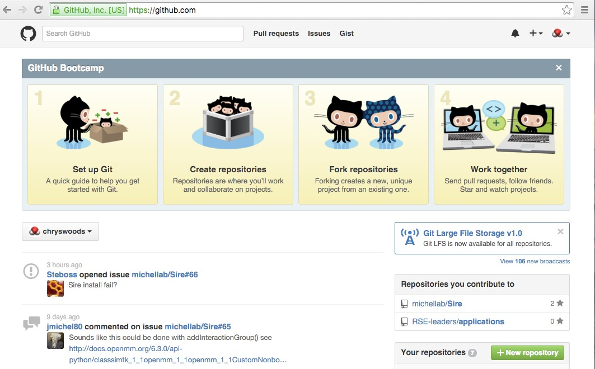
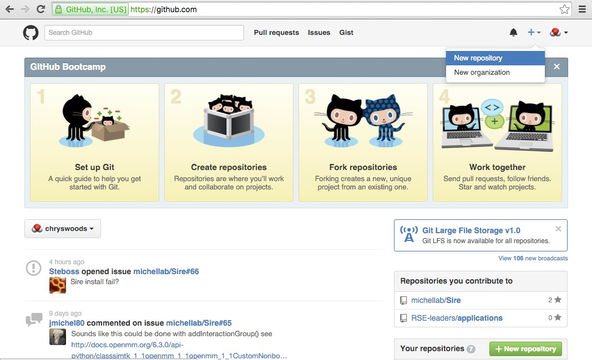
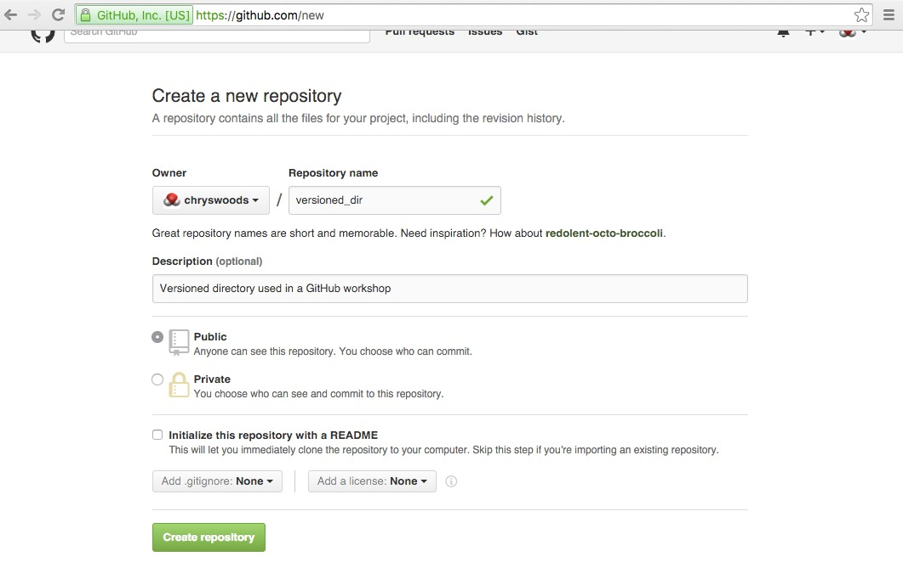

# Git in the Cloud

So far, your working directory is only stored on your computer.
The working directory (in our case `versioned_dir`)
is not shared with anyone else, and it is not safely backed up in case
of disk failure. On top of this, all of the version information about
this directory, which is used by Git to move back and forth through
time, is saved in a hidden directory called `.git`.

Move the `HEAD` to the latest commit of `master`, using

```
git checkout master
```

Now type

```
ls -a
```

You should see something like

```
.  ..  base.pyc  .git  .gitignore  README.MD  something.o  source.o  subdir
```

Note that you can see a hidden directory called `.git`. Take a look in this
directory using

```
ls .git
```

You should see something like

```
branches        config       HEAD   index  logs     ORIG_HEAD
COMMIT_EDITMSG  description  hooks  info   objects  refs
```

These files contain the full set of metadata that fully describes all
versions of your working directory. Note that you should NEVER change or
edit any files in this directory, as you will seriously confuse Git and
will corrupt your version history.

What this means is that if you remove your working directory
(e.g. if you type `rm -rf versioned_dir`) you will also completely
remove the `.git` directory, and thus all version information. 
Git is providing version control, but it is 
not providing a safe backup.

# Safely backup to the cloud

Fortunately, Git is designed to provide what is called "distributed
version control". What this means is that you can easily put a copy
of all of your version information onto another computer, and can
even put all of the version information into a Git-based cloud service.

There are two main Git-based cloud services available;

* [GitHub](https://github.com)
* [BitBucket](https://bitbucket.org)

Both provide completely free online Git hosting, and I use both regularly.
For this workshop I am recommending GitHub, although don't take this
as any indication that GitHub is better than BitBucket.

If you haven't already, please [go here](github_register.md) for instructions
on how to create and login to your GitHub account.

Now, open a browser window to [https://github.com](https://github.com) and 
log into your GitHub account. Once logged in you should see something
like this



This shows your GitHub username (in my case, chryswoods), together with
the set of repositories to which you contribute (in your case, probably 
not many yet, but in my case, michellab/Sire etc.). Repository is the
term we use to refer to the complete set of version information about
a version controlled directory. A repository contains the complete set
of all versions of a single directory (and everything contained within
that directory). For example, michellab/Sire is a directory that contains
the source code for my [Sire molecular simulation framework](http://siremol.org),
and the michellab/Sire repository contains every single version of every
file that is in that directory.

## Creating a new repository

Let us now create a new repository on GitHub. To do this, click on the 
"+" sign at the top of the screen and select "New Repository", as in the
picture below.



Now fill in the information required in the form as in the picture below.
Note that "Owner" will be your GitHub user name, and not "chryswoods".



This tells GitHub to create a new repository called `versioned_dir`, 
and supplies a useful description. The repository is "public", meaning
that anyone is allowed to read the contents and download it. GitHub allows
unlimited free public repositories, but you have to pay for a private
account if you want to have a private repository.

Click "Create Repository" to create your new repository.

***

# [Previous](subdirs.md) [Up](README.md) [Next](push.md)
