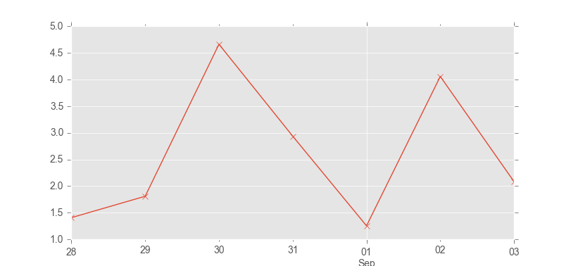

---
---

# The Pandas data analysis toolkit

[Andrew Tedstone](http://atedstone.github.io), October 2016 

[Pandas website](http://pandas.pydata.org)

Pandas is your data analysis toolkit. It's the best option for opening up all sorts of datasets, checking them, quickly plotting them, manipulating them, computing statistics using Pandas-aware packages, and exporting to new files. 

Below is a very brief tutorial that covers the most important aspects of the package. For more info, check out the tutorials and documentation on the website above. I also recommend the book 'Python for Data Analysis' by Wes McKinney, who wrote the Pandas software.


## Toy weather data

The file [weather.csv](weather.csv) contains a few days of selected weather data from Solheimajokull, a glacier in southern Iceland. Download it and save it with your other course files.

We're going to use it as an example dataset for Pandas. In this case, the data are labelled with dates and times, but you don't have to use Pandas like this - you can load up any tabulated data you like.


## Open the data

You might first want to open the CSV file up in Excel to see it presented in a way you are familiar with.

Let's use the Pandas function that loads CSV files into a Pandas DataFrame. Note that we also need to import matplotlib first:

```python
import matplotlib.pyplot as plt
import pandas as pd
weather = pd.read_csv('weather.csv', index_col='Date', parse_dates=True)
```

There's a couple of things to note about our `read_csv` command. First, we are telling Pandas that our index/label column, which aligns all the values in the other columns, is called 'Date'. Second, we want Pandas to 'parse', or convert the date/time strings into special datetime objects which are calendar- and clock-aware. For more information on this take a look at the [Pandas documentation on time series](http://pandas.pydata.org/pandas-docs/stable/timeseries.html).

Let's take a quick look at what the dataset contains:

```python
weather.head()
```
```
                     AirTemp  Humidity  WindSpd
Date                                           
2013-08-28 17:00:00     12.1      63.8      0.3
2013-08-28 17:30:00     10.8      72.6      1.4
2013-08-28 18:00:00     10.5      73.5      2.0
2013-08-28 18:30:00      9.7      74.5      1.2
2013-08-28 19:00:00      9.8      75.9      1.8

```

The `head()` command shows us the structure of the dataset and the first few lines of data. Here we can see that we have three columns: Air Temperature, Humidity and Wind Speed. These are all indexed, or labelled, together by Date.

We can calculate some summary statistics for the whole dataset:

```python
weather.describe()
```
```
          AirTemp    Humidity     WindSpd
count  292.000000  292.000000  292.000000
mean     8.253767   75.866781    2.757192
std      1.627139   10.426909    2.199402
min      4.500000   45.100000    0.300000
25%      7.200000   68.800000    0.700000
50%      8.100000   75.850000    2.250000
75%      9.225000   84.675000    4.400000
max     18.400000   91.400000    8.500000

```

From the output above we can see that the dataset has 292 rows. The mean air temperature during the period of observations is 8.3 degrees celsius. Humidity has a standard deviation of 10.4 %. The maximum wind speed observed was 8.5 metres per second.

Let's plot the time series of air temperatures:

```python
weather['AirTemp'].plot()
# If the plot doesn't appear, run this line as well:
plt.show()
```

Pandas pops up a plot labelled with the dates and the name of the time series you are looking at, which should look a bit like the following (ignore the different styling):


Now close the window.

You can pull out bits of data by date or time. Let's just look at the data for 29 August 2013:

```python
weather['2013-08-29']
```
```
                     AirTemp  Humidity  WindSpd
Date                                           
2013-08-29 00:00:00      8.4      82.5      1.2
2013-08-29 00:30:00      8.2      76.2      2.1
2013-08-29 01:00:00      8.0      71.2      1.7
 ... all the data between these times shown ...
2013-08-29 22:30:00     10.2      89.0      2.3
2013-08-29 23:00:00      9.9      90.6      3.1
2013-08-29 23:30:00      9.9      90.9      2.7
```

You can chain the indexing with `.describe()` to get summary statistics about just this portion of the dataset:

```python
weather['2013-08-29'].describe()
```
```
         AirTemp   Humidity    WindSpd
count  48.000000  48.000000  48.000000
mean    8.552083  83.787500   1.808333
std     0.976313   6.961769   0.684116
min     6.600000  71.200000   0.600000
25%     7.900000  76.425000   1.275000
50%     8.500000  88.150000   1.800000
75%     9.300000  89.550000   2.300000
max    10.200000  91.100000   3.100000
```

We can see that 48 observations were made on 29 August and that the maximum air temperature was 10.2 degrees celsius.

Or we can pull out a range of dates and times, in this case just for 6 hours of the 29th Aug:

```python
weather['2013-08-29 15:00':'2013-08-29 21:00']
```
```
                     AirTemp  Humidity  WindSpd
Date                                           
2013-08-29 15:00:00      9.0      90.0      1.3
2013-08-29 15:30:00      9.2      90.0      1.8
2013-08-29 16:00:00      8.8      90.0      0.6
2013-08-29 16:30:00      7.9      89.3      1.0
2013-08-29 17:00:00      7.6      89.8      0.8
2013-08-29 17:30:00      8.5      89.7      0.9
2013-08-29 18:00:00      8.5      89.1      1.2
2013-08-29 18:30:00      9.1      88.0      2.2
2013-08-29 19:00:00      8.7      89.1      0.9
2013-08-29 19:30:00      9.5      89.4      1.4
2013-08-29 20:00:00      9.7      88.9      1.6
2013-08-29 20:30:00     10.0      88.6      3.0
2013-08-29 21:00:00     10.1      88.3      2.3
```

At the moment, we can see that the data have a 30 minute resolution. What about daily averages?

```python
weather_daily_avg = weather.resample('24H').mean()
weather_daily_avg['WindSpd'].plot()
plt.show()
```



*Note, the resampling interface to Pandas has changed recently. If the code above just calculates a single value, then you need to use the old function, like this:*

```python
weather_daily_avg = weather.resample('24H', how='mean')
```

Using our original 30-minute data, we can also look at average temperature throughout a 24 hour cycle. To do this we need to 'group' the data by hour of the day and then take the average of all those values.

```python
temp_cycle = weather['AirTemp'].groupby(weather.index.hour).mean()
temp_cycle.plot()
plt.xlabel('Hour of day')
plt.ylabel('Temperature')
plt.show()
```


If you want, you can compare this average daily temperature cycle back to the full temperature time series. Hopefully you'll see that the peak temperature of around 9.5 degrees C at 18:00 is a feature of the original data set.

Lastly, let's export our average daily values to a new file:

```python
weather_daily_avg.to_csv('weather_daily_avg.csv')
```
